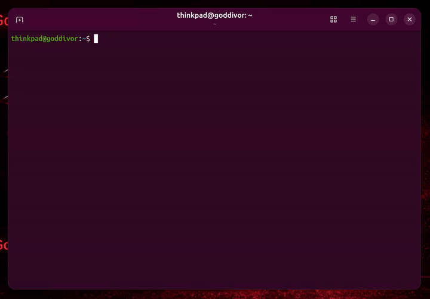
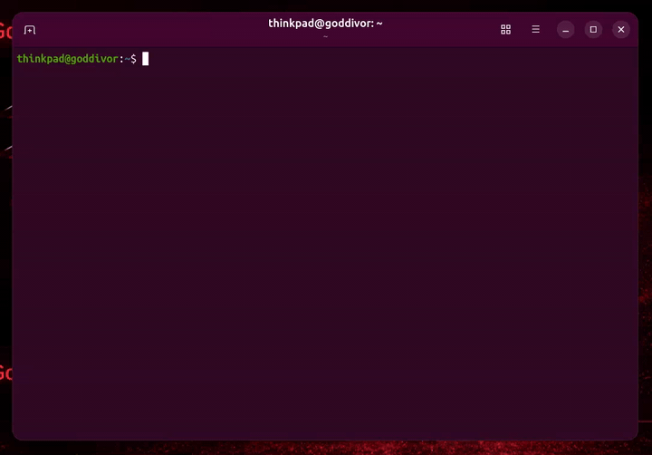

<div align="center">

# adb-qr-cli

[](https://www.typescriptlang.org/)
[](https://nodejs.org/)
[](https://developer.android.com/tools/releases/platform-tools)
[](https://opensource.org/licenses/MIT)

[](https://www.npmjs.com/package/commander)
[](https://www.npmjs.com/package/bonjour-service)
[](https://www.npmjs.com/package/qrcode-terminal)
[](https://www.npmjs.com/package/qrcode)
[](https://www.npmjs.com/package/@inquirer/prompts)
[](https://www.npmjs.com/package/chalk)
[](https://www.npmjs.com/package/ora)

[](https://github.com/goddivor/adb-qr-cli/stargazers)
[](https://github.com/goddivor/adb-qr-cli/network/members)
[](https://github.com/goddivor/adb-qr-cli/watchers)
[](https://github.com/goddivor/adb-qr-cli/graphs/contributors)
[](https://github.com/goddivor/adb-qr-cli/issues)

Connect an **Android phone** to your PC over **Wi-Fi** with **ADB**, straight from the terminal —
no cable, no IDE, no GUI.

Scan a QR code printed in your shell, or pick a device the CLI discovered on the network, and it
pairs and connects for you. CLI port of the
[ADB-QR VSCode extension](https://github.com/aakashpsindhi/ADB-QR).



<hr width="700" />



</div>

## 🎖️ Features

- **QR pairing in the terminal** — the QR code is rendered as ASCII in your shell, scanned straight
  from the phone's wireless debugging screen
- **Code pairing** — lists the devices found on the network and asks for the 6-digit code when
  scanning a QR is not convenient
- **One-command reconnect** — a phone already paired with this PC is found and reconnected without
  any input
- **Automatic device discovery** — mDNS scan of the LAN for the `adb-tls-pairing` and
  `adb-tls-connect` services, so no IP address is ever typed by hand
- **Full handshake, not just pairing** — pairing is followed by the connect handshake, and the
  device is reported by its real model name once online
- **ADB preflight** — checks that `adb` is on the `PATH` and recent enough before doing anything,
  and says which of the two failed
- **Bounded waits** — every scan times out after 30 seconds instead of hanging the terminal

## 📋 Requirements

- Node.js >= 18
- ADB version 32 or later, available in `PATH` (`adb --version` must work in the same shell)
- An Android 11+ phone with Developer Options and Wireless Debugging enabled
- Phone and PC on the **same Wi-Fi network** — not a guest or client-isolated SSID, and with
  mobile data turned off on the phone

## 📦 Installation

Install it globally to use the `adb-qr` command anywhere:

```bash
# npm
npm i -g adb-qr-cli

# yarn
yarn global add adb-qr-cli

# pnpm
pnpm add -g adb-qr-cli
```

Or run it without installing anything:

```bash
npx adb-qr-cli qr
```

From a clone:

```bash
git clone https://github.com/goddivor/adb-qr-cli.git
cd adb-qr-cli
npm install
npm run build
npm link        # exposes the `adb-qr` binary globally
```

## ⚙️ Usage

Three commands, one per pairing flow.

```bash
# The default flow: pair by scanning a QR code
adb-qr qr

# Pair with the 6-digit code instead
adb-qr pair

# Reconnect a phone already paired with this PC
adb-qr connect

# Command list and version
adb-qr --help
adb-qr --version
```

### 📱 `adb-qr qr`

Prints a QR code in the terminal, pairs with whichever phone scans it, then waits for the connect
handshake and connects automatically.

```
On the phone:
  Settings > Developer Options > Wireless Debugging > Pair device with QR code
```

### 🔢 `adb-qr pair`

Scans the network, lists every device advertising a pairing service, and asks for the 6-digit code
displayed on the phone. Pairing is followed by the same automatic connect step.

```
On the phone:
  Settings > Developer Options > Wireless Debugging > Pair device with pairing code
```

### 🔌 `adb-qr connect`

For a device already paired with this PC. Scans the LAN for `adb-tls-connect` services and connects
to the first one that answers — nothing to type.

```
On the phone:
  Settings > Developer Options > Wireless Debugging   (just open the screen)
```

### 🛠️ Troubleshooting

**Pairing succeeds but the connect handshake never comes.** The phone has usually stopped
advertising its `adb-tls-connect` service after an interrupted session. Reset both sides — toggle
**Wireless Debugging OFF then ON** on the phone, restart the ADB server, then run `adb-qr qr` again:

```bash
adb kill-server && adb start-server
```

**`ADB is not installed or PATH is not configured`.** Check that `adb --version` works in the shell
you are running the CLI from. On Linux and macOS, `adb` ships with the Android platform-tools.

**`ADB version XX is too old`.** Wireless debugging needs platform-tools 32 or later. Update through
your package manager, or
[download the latest platform-tools](https://developer.android.com/tools/releases/platform-tools).

**Nothing is found during the scan.** Confirm the phone and the PC really are on the same Wi-Fi
network, that the network is not client-isolated, and that mobile data is off on the phone.

## 🤝 Contributing

Contributions of all kinds are welcome — bug reports, feature ideas, documentation fixes and pull
requests. Open an [issue](https://github.com/goddivor/adb-qr-cli/issues) to discuss a change first,
and make sure `npm run build` passes with zero errors before sending a pull request.

## 📜 License

Licensed under MIT License and copyrights reserved.
